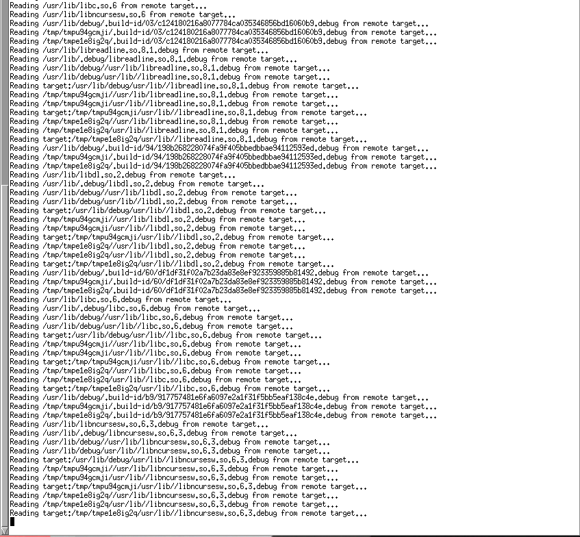
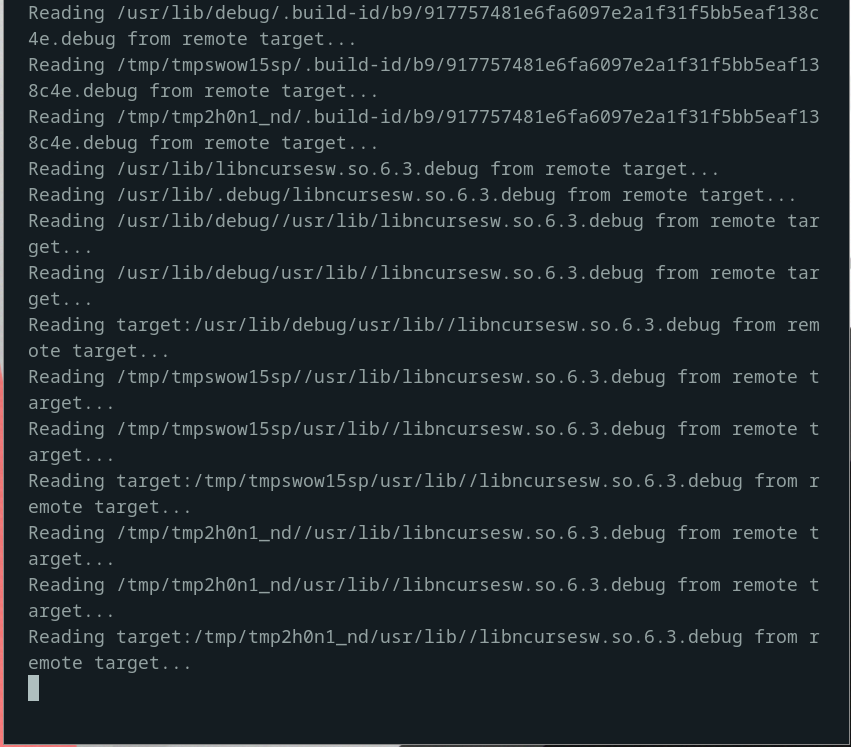

# Prettifying your urxvt session ;)

If your urxvt session looks like this



Then I would suggest that you pop the below stuff into your `~/.Xresources`, and it should look like this!



You'll also need to use `xrdb ~/.Xresources` below make sure the updates are recognised

```shell
!! Colorscheme

! special
*.foreground: #93a1a1
*.background: #141c21
*.cursorColor: #afbfbf

! black
*.color0: #263640
*.color8: #4a697d

! red
*.color1: #d12f2c
*.color9: #fa3935

! green
*.color2: #819400
*.color10: #a4bd00

! yellow
*.color3: #b08500
*.color11: #d9a400

! blue
*.color4: #2587cc
*.color12: #2ca2f5

! magenta
*.color5: #696ebf
*.color13: #8086e8

! cyan
*.color6: #289c93
*.color14: #33c5ba

! white
*.color7: #bfbaac
*.color15: #fdf6e3

!! URxvt Appearance
URxvt.letterSpace: 0
URxvt.lineSpace: 0
URxvt.geometry: 92x24
URxvt.internalBorder: 24
URxvt.cursorBlink: true
URxvt.cursorUnderline: false
URxvt.saveline: 2048
URxvt.scrollBar: false
URxvt.scrollBar_right: false
URxvt.urgentOnBell: true
URxvt.depth: 24
URxvt.iso14755: false
urxvt.font: xft:Inconsolata:pixelsize=18
```